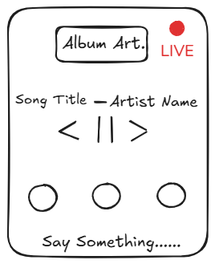

# 🎧 Spotify "Live Rooms" Feature Strategy
**Role:** Product Manager | **Focus:** User Engagement & Social Features

-blue)

## 📄 Project Overview
This project focuses on increasing user time-in-app by solving a key friction point: **The lack of real-time social connection while listening.** Instead of users leaving Spotify to chat on Discord or WhatsApp, "Live Rooms" allows friends to listen in sync and chat directly within the interface.

---

## 🎨 The Solution (Wireframe)
*A low-fidelity mockup of the proposed "Live Room" interface.*

> **[📄 CLICK HERE TO READ THE FULL PRODUCT SPEC (PDF)](Product_Spec_Spotify_Live_Rooms.pdf)**

---

## 🎯 Strategic Goals (KPIs)
* **Primary Goal:** Increase "Average Listening Time" by 8% via social engagement.
* **Secondary Goal:** Achieve 15% adoption rate among Daily Active Users (DAU) within 3 months.

---

## 🛠️ Skills Applied
* **User Empathy:** Identified the "Loneliness Gap" in current streaming behavior.
* **Wireframing:** Designed UI mockups for a seamless mobile experience.
* **Metrics Definition:** Defined Success Metrics (Engagement) and Guardrail Metrics (Churn).
* **Go-To-Market:** Created a launch strategy focusing on Influencers and "FOMO."

---
*Author: [PRAVEENKUMAR KODAVATH]*
